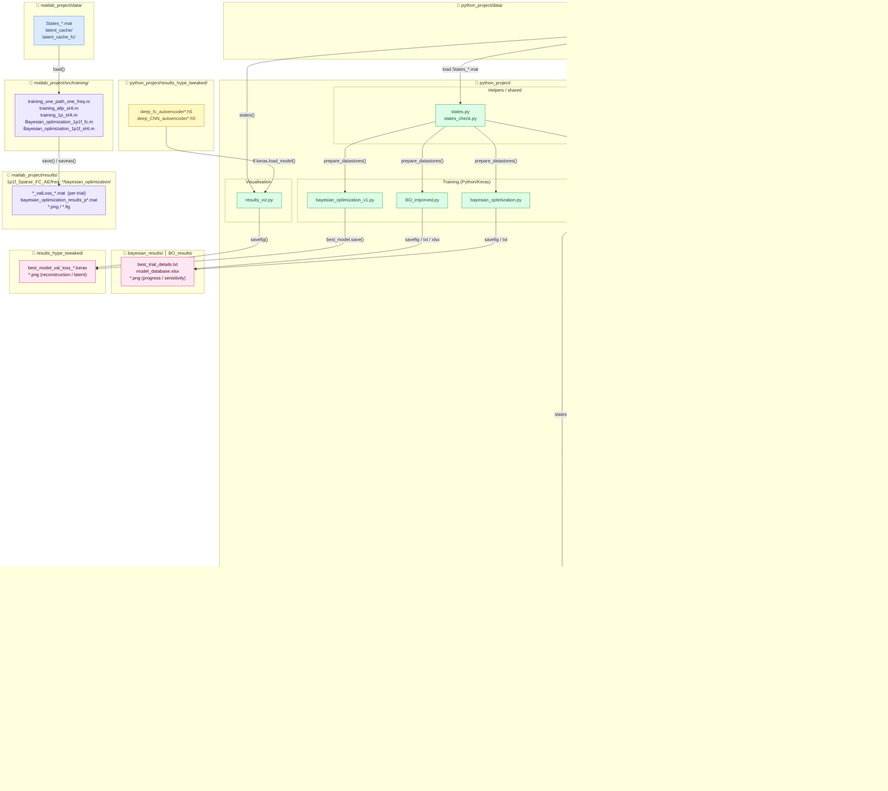

# GAN Project — File & Directory Flowchart

Render this in VS Code with the **Markdown Preview Mermaid Support** extension,
or paste the diagram block into https://mermaid.live

```mermaid
flowchart TD

    %% ── INPUT DATA ──────────────────────────────────────────────
    subgraph SRC_DATA["📁 python_project/data/"]
        MAT["States_103.mat\nStates_104.mat\nStates_105.mat\nStates_109.mat\nStates_123_*.mat"]
    end

    subgraph SRC_DATA_M["📁 matlab_project/data/"]
        MAT_M["States_*.mat\nlatent_cache/\nlatent_cache_fc/"]
    end

    %% ── PRE-TRAINED KERAS AUTOENCODERS ──────────────────────────
    subgraph MULTI_PATH["📁 Multi_path_{timestamp}/"]
        H5["*.h5\n(Keras AE models, one per path)"]
    end

    subgraph HYPE["📁 python_project/results_hype_tweaked/"]
        H5_BEST["deep_fc_autoencoder*.h5\ndeep_CNN_autoencoder*.h5"]
    end

    %% ── PYTHON PIPELINE ─────────────────────────────────────────
    subgraph PY["📁 python_project/"]

        subgraph HELPERS["Helpers / shared"]
            ST["states.py\nstates_check.py"]
            WM["weight_matrix.py"]
        end

        subgraph TRAIN_PY["Training (Python/Keras)"]
            BT["big_train.py"]
            BO1["bayesian_optimization.py"]
            BO2["bayesian_optimization_v1.py"]
            BOI["BO_imporved.py"]
        end

        subgraph GRAPH_PIPE["Graph Dataset Pipeline"]
            EXSHI["extract_shi.py"]
            GDS["graph_dataset.py"]
        end

        subgraph GCN_PIPE["GCN Pipeline"]
            GCNT["GCN_train.py\n+ GCN.py"]
            IMG["imagining_alghoritm.py"]
            DM["damage_map.py"]
        end

        subgraph VIZ["Visualisation"]
            RVZ["results_viz.py"]
        end

    end

    %% ── INTERMEDIATE STORES ─────────────────────────────────────
    subgraph GRAPH_DATA["📁 graph_data/"]
        RAW_PT["raw/\npanel_*_shi_raw_3.pt"]
        PROC_PT["processed/\npanel_*_processed*.pt\npanel_*_processed_big_latent*.pt"]
    end

    %% ── MODEL OUTPUTS ───────────────────────────────────────────
    subgraph GCN_OUT["📁 GCN_models/"]
        GCN_PT["gcn.pt\ngcn_big_latent.pt"]
    end

    subgraph TRAIN_OUT["📁 model_train_results/{timestamp}/"]
        H5_OUT["*.h5  (trained AE models)\n*.png (loss / sHI curves)"]
    end

    subgraph BO_OUT["📁 bayesian_results/  │  BO_results/\nresults/Bayesian_{type}_{date}/"]
        BO_FILES["best_trial_details.txt\nmodel_database.xlsx\n*.png (progress / sensitivity)"]
    end

    subgraph HYPE_OUT["📁 results_hype_tweaked/"]
        HYPE_FILES["best_model_val_loss_*.keras\n*.png (reconstruction / latent)"]
    end

    subgraph MATLAB_RES["📁 matlab_project/results/\n1p1f_Sparse_FC_AE/freq_*/bayesian_optimization/"]
        MAT_RES["*_valLoss_*.mat  (per trial)\nbayesian_optimization_results_p*.mat\n*.png / *.fig"]
    end

    subgraph ROOT_OUT["📁 Project root"]
        GIFS["panel_*_WCPDI_animation.gif\npanel_*_sHI_animation.gif"]
    end

    %% ── MATLAB PIPELINE ─────────────────────────────────────────
    subgraph MATLAB_SRC["📁 matlab_project/src/training/"]
        MT["training_one_path_one_freq.m\ntraining_allp_sHI.m\ntraining_1p_sHI.m\nBayesian_optimization_1p1f_fc.m\nBayesian_optimization_1p1f_sHI.m"]
    end

    %% ══════════════════════════════════════════════════════════
    %% DATA FLOW EDGES
    %% ══════════════════════════════════════════════════════════

    %% Input data → helpers
    MAT  -->|"load States_*.mat"| ST
    MAT  -->|"load States_*.mat"| WM

    %% Input data → Python training
    ST   -->|"prepare_simple_dataset()"| BT
    ST   -->|"prepare_datastores()"| BO1
    ST   -->|"prepare_datastores()"| BO2
    ST   -->|"prepare_datastores()"| BOI

    %% Python training → model outputs
    BT   -->|"model.save()"| H5_OUT
    H5_OUT -->|"copied/moved to"| H5
    BO1  -->|"savefig / txt"| BO_FILES
    BO2  -->|"best_model.save()"| HYPE_FILES
    BOI  -->|"savefig / txt / xlsx"| BO_FILES

    %% extract_shi pipeline
    H5   -->|"tf.keras.load_model()"| EXSHI
    MAT  -->|"prepare_simple_dataset()"| EXSHI
    EXSHI -->|"torch.save() → graph_data/raw/"| RAW_PT

    %% graph_dataset pipeline
    RAW_PT -->|"torch.load()"| GDS
    MAT    -->|"states() for adj matrix"| GDS
    WM     -->|"adjencency_matrix()"| GDS
    GDS    -->|"torch.save() → graph_data/processed/"| PROC_PT

    %% GCN training
    PROC_PT -->|"Panel_GraphDataset()"| GCNT
    GCNT    -->|"torch.save(model)"| GCN_PT

    %% Inference / imaging
    GCN_PT  -->|"torch.load()"| IMG
    PROC_PT -->|"Panel_GraphDataset()"| IMG
    IMG     -->|"anim.save()"| GIFS

    MAT     -->|"states()"| DM
    DM      -->|"save gif"| GIFS

    %% Visualisation
    H5_BEST -->|"tf.keras.load_model()"| RVZ
    MAT     -->|"states()"| RVZ
    RVZ     -->|"savefig()"| HYPE_FILES

    %% MATLAB pipeline
    MAT_M   -->|"load()"| MT
    MT      -->|"save() / saveas()"| MAT_RES

    %% ── STYLES ───────────────────────────────────────────────────
    classDef data    fill:#dbeafe,stroke:#3b82f6,color:#1e3a5f
    classDef script  fill:#dcfce7,stroke:#16a34a,color:#14532d
    classDef store   fill:#fef9c3,stroke:#ca8a04,color:#713f12
    classDef output  fill:#fce7f3,stroke:#db2777,color:#500724
    classDef matlab  fill:#ede9fe,stroke:#7c3aed,color:#2e1065

    class MAT,MAT_M data
    class ST,WM,BT,BO1,BO2,BOI,EXSHI,GDS,GCNT,IMG,DM,RVZ script
    class H5,H5_BEST,RAW_PT,PROC_PT,GCN_PT store
    class H5_OUT,BO_FILES,HYPE_FILES,MAT_RES,GIFS output
    class MT,MAT_RES matlab
```
